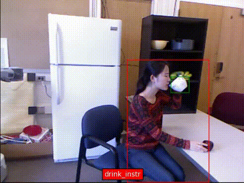
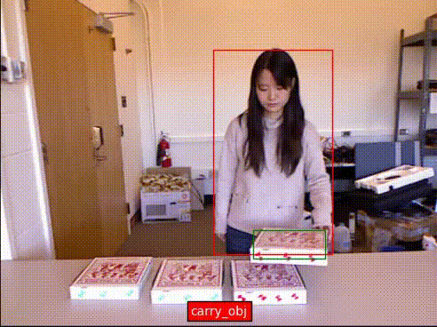
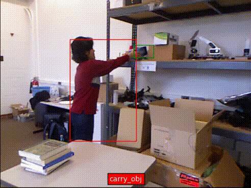

# SGPT: The Secondary Path Guides the Primary Path in Transformers for HOI Detection

## Demo







## Results in HICO-DET and VCOCO

### HICO-DET

| Methods    | Full(D) | Rare(D) | Non-Rare(D) | Full(KO) | Rare(KO) | Non-Rare(KO) |
| ---------- | ------- | ------- | ----------- | -------- | -------- | ------------ |
| QPIC(R50)  | 29.08   | 22.48   | 31.05       | 31.41    | 24.00    | 33.63        |
| QPIC(R101) | 29.64   | 23.27   | 31.55       | 32.32    | 26.21    | 34.15        |
| Ours(R50)  | 29.69   | 22.62   | 31.81       | 31.90    | 24.38    | 34.14        |
| Ours(R101) | 30.08   | 24.00   | 31.89       | 32.40    | 26.49    | 34.16        | 

### VCOCO

| Methods    | Scenario 1 | Scenario 2 |
| ---------- | ---------- | ---------- |
| QPIC(R50)  | 58.60      | 60.90      |
| QPIC(R101) | 58.30      | 60.70      |
| Ours(R50)  | 59.31      | 61.30      |
| Ours(R101) | 60.25      | 62.29      |


## Pre-request

- pretrained model: [qpic](https://github.com/hitachi-rd-cv/qpic)
- data file format followed by qpic
- hico dataset can be downloaded from [here](https://drive.google.com/open?id=1QZcJmGVlF9f4h-XLWe9Gkmnmj2z1gSnk)
- vcoco dataset can be download from [here](https://github.com/s-gupta/v-coco)
- our annotations of vcoco and hico can be downloaded from [vcoco](https://1drv.ms/u/s!ApoClY4Sak9xk3lUEA7H6SsmKtuQ?e=O6a4uF), [hico](https://1drv.ms/u/s!ApoClY4Sak9xk3pRFDerFG-TfZrN?e=IbCh2d)
- Please refer to qpic for data preparation from [here](https://github.com/hitachi-rd-cv/qpic)

## Training

```shell
# vcoco r50
sh scripts/train_vcoco_50.sh
# hico r50
sh scripts/train_hico_50.sh
```

## Evalution
Our Model pth can be downloaded at [model.pth](https://1drv.ms/u/s!ApoClY4Sak9xk3-E-v0WlALRfDj_?e=EdlTOB)
### vcoco

1. generate pickle file by offical code
2. evaluating by offical

```shell
sh scripts/generate_vcoco_official.sh
```

### hico

**two options:**

- result of evalution displayed in logs of training.
- evaluating by scripts offered by ours.
```shell
sh scripts/eval_hico_101.sh
```
